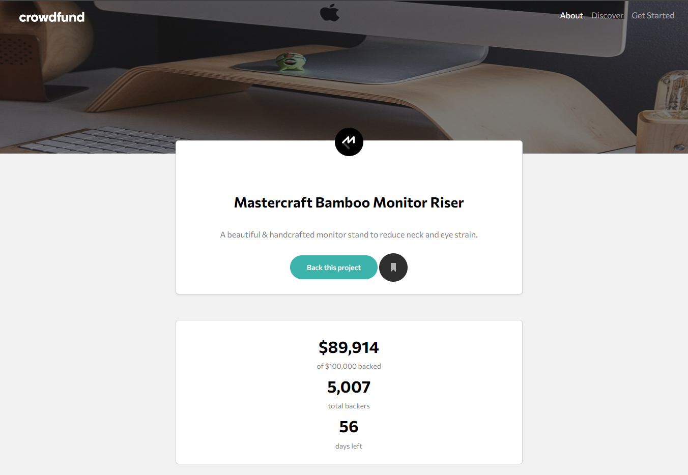
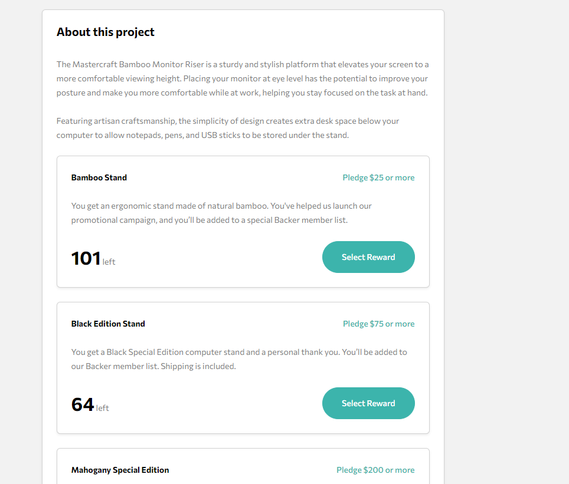

# Frontend Mentor - Crowdfunding product page solution

This is a solution to the [Crowdfunding product page challenge on Frontend Mentor](https://www.frontendmentor.io/challenges/crowdfunding-product-page-7uvcZe7ZR). Frontend Mentor challenges help you improve your coding skills by building realistic projects. 

## Table of contents

- [Overview](#overview)
  - [The challenge](#the-challenge)
  - [Screenshot](#screenshot)
  - [Links](#links)
- [My process](#my-process)
  - [Built with](#built-with)
  - [What I learned](#what-i-learned)
  - [Continued development](#continued-development)
  - [Useful resources](#useful-resources)
- [Author](#author)
- [Acknowledgments](#acknowledgments)

## Overview

### The challenge

Users should be able to:

- View the optimal layout depending on their device's screen size
- See hover states for interactive elements
- Make a selection of which pledge to make
- See an updated progress bar and total money raised based on their pledge total after confirming a pledge
- See the number of total backers increment by one after confirming a pledge
- Toggle whether or not the product is bookmarked

### Screenshot

### Links

- Solution URL: [Add solution URL here](https://your-solution-url.com)
- Live Site URL: [Add live site URL here](https://your-live-site-url.com)

## My process

### Built with

- Semantic HTML5 markup
- CSS custom properties
- Bootstrap
- Flexbox
- Mobile-first workflow

### What I learned

It was my goal to buil aa webpage almost entirely with Bootstrap with minimal custom CSS. I had worked briefly with older versions of Bootstrap so it was a challenge getting to know version 5.

### Continued development

This project is still under construction. The desktop layout still has to be improved as well as the modal section. 

### Useful resources

- [Bootstrap Docs](https://getbootstrap.com/docs/5.2/getting-started/introduction/) - Easy to read and navigate, it helped me find what I needed faster and sped up my production.

## Author

- Website - [gcardenasdev](https://github.com/gcardenasdev)
- Frontend Mentor - [@gcardenasdev](https://www.frontendmentor.io/profile/gcardenasdev)

